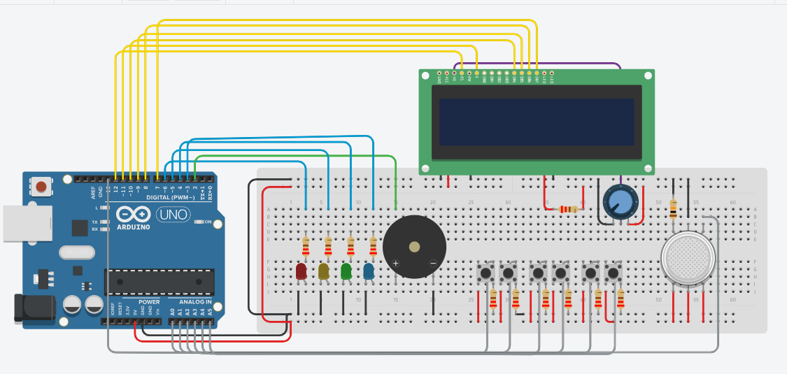

<h1 align="center" color="#3a4dff">SafeSchool Alert</h1>

El sistema **SafeSchool Alert** es una plataforma de alertas escolares desarrollada con **MIT App Inventor** y el microcontrolador **Arduino Uno**. El sistema pretende solucionar la problemática de la deficiencia al momento de informar y alertar a la población educativa durante una emergencia que ponga en riesgo la seguridad de los estudiantes o del personal docente. Para solucionar esta problemática se desarrolla **SafeSchool Alert**, un sistema que pretende ser el intermediario informativo al momento de detectar y comunicar una emergencia dentro de una institución educativa.

> [!NOTE]
> Es de vital importancia recalcar que, actualmente, el proyecto se encuentra en la **fase N.° 2**, la cual consiste en desarrollar el prototipo funcional propuesto del sistema y del circuito real en Tinkercad. Por esta razón, en este avance el repositorio únicamente contiene el código fuente del Arduino, escrito en C++, y el diseño y la lógica del circuito electrónico. La aplicación móvil aún no forma parte de esta fase, por lo que será desarrollada y presentada en una fase posterior del proyecto SafeSchool Alert.

## Caracteríticas Principales

- **Comunicación serial** por medio de comandos (_parsers_).
- **Detección automática** de incendios.
- **Activación de emergencias manuales** por medio de pulsadores.
- **Detección automática** de la ubicación y el tipo de emergencia.
- **Mensajes de estado** por medio de pantalla LCD y monitor serial.
- **Sirena continua** y sirena intermitente.
- **LEDs de estado** para las diferentes emergencias.
- **Comunicación y actualización mutua** entre la aplicación y Arduino.

## Tabla de Componenetes Electronicos

En este apartado se presentan los distintos componentes importantes y empleados para construir el circuito, como la cantidad de componentes, función e importancia de cada componente dentro del sistema

| N°  | Función       |                                              | Cantidad | Valor |
| --- | ------------- | -------------------------------------------- | -------- | ----- |
| 1   | Arduino       | Microcontrolador en cargado de compilar      | 1        | ~~    |
|     |               | el código y tomar decisiones en el           |          |       |
|     |               | circuito y activación de componentes         |          |       |
|     |               | (El celebro del circuito).                   |          |       |
| --- | ------------- | -------------------------------------------- | -------- | ----- |
| 1   | Sensor MQ-2   | Detecta niveles peligrosos de humo y         | 1        | ~~    |
|     |               | gas, permitiendo identificar automáticamente |          |       |
|     |               | posibles incendios o situaciones de          |          |       |
|     |               | riesgo po incendio.                          |          |       |
| --- | ------------- | -------------------------------------------- | -------- | ----- |
| 2   | Pantalla LCD  | Mostrar mensajes de estado e información     | 1        | ~~    |
|     |               | de emergencias activas o detectadas          |          |       |
|     |               | en la nstitución.                            |          |       |
| --- | ------------- | -------------------------------------------- | -------- | ----- |
| 3   | Potenciómetro | Su función en el circuito es ajustar el      | 1        | 4V    |
|     |               | contraste, de la pantalla LCD para           |          |       |
|     |               | que esta muestre una imagen con mejor        |          |       |
|     |               | resolución.                                  |          |       |
| --- | ------------- | -------------------------------------------- | -------- | ----- |
| 4   | LED Rojo      | Indica una emergencia activa detectada.      | 1        | ~~    |
| --- | ------------- | --------------------------------------- ---- | -------- | ----- |
| 4   | LED Verde     | Indica que la emergencia activa fue          | 1        | ~~    |
|     |               | atendida.                                    |          |       |
| --- | ------------- | -------------------------------------------- | -------- | ----- |
| 4   | LED Amarillo  | Indica que la emergencia activa está en      | 1        | ~~    |
|     |               | proceso.                                     |          |       |
| --- | ------------- | -------------------------------------------- | -------- | ----- |
| 4   | LED Azul      | Indica que la emergencia activa es           | 1        | ~~    |
|     |               | falsa.                                       |          |       |
| --- | ------------- | -------------------------------------------- | -------- | ----- |
| 4   | Pulsadores    | Activan una emergencia manualmente, ya       | 6        | ~~    |
|     |               | sea Médica o de Seguridad.                   |          |       |
| --- | ------------- | -------------------------------------------- | -------- | ----- |
| 4   | Resistencia   | Limita el flujo de corriente que pasa por el | 1        | 10 kΩ |
|     |               | circuito para proteger los componentes.      |          |       |
| --- | ------------- | -------------------------------------------- | -------- | ----- |
| 4   | Resistencia   | Limita el flujo de corriente que pasa por el | 12       | 220 Ω |
|     |               | circuito para proteger los componentes.      |          |       |
| --- | ------------- | -------------------------------------------- | -------- | ----- |

## Tecnologías Utilizadas

| Tecnología       | Descripción                       |
| ---------------- | --------------------------------- |
| Arduino Uno      | Microcontrolador principal        |
| C++              | Programación del sistema embebido |
| MIT App Inventor | Desarrollo de la aplicación móvil |
| Tinkercad        | Simulación del circuito           |
| Git              | Control de versiones              |
| GitHub           | Gestión del repositorio           |

---

## Circuito del Sistema



El circuito esta conectado de acuerdo con la función de cada componente, respetando la posición de sus pines y, cuando es necesario, su polaridad. Esto permite que cada elemento funcione correctamente dentro del sistema y evita errores en el funcionamiento del circuito. Por esta razón, las conexiones no se realizaron al azar, sino siguiendo la forma correcta en que cada componente debe instalarse.

## Protocolo de Comunicación

Todos los mensajes enviados entre la aplicación y Arduino siguen un formato establecido. Si la aplicación envía un comando que no cumple con el protocolo de comunicación, el Arduino ignorará todos los comandos enviados que no cumplan el formato establecido y mostrará un error de tipo `[COMMAND ERROR]` en serial. De igual manera, el sistema solo permite comandos de un máximo de 30 caracteres; si el comando sobrepasa el límite de caracteres, el Arduino ignorará el comando y mostrará un error de tipo `[COMMAND ERROR]` en serial.

### Comandos de comunicación:

#### 1. Cambiar estado de emergencia Médica a Atendida:

```bash
Medica,Atendida#
```

#### 2. Cambiar estado de emergencia Médica a En Proceso:

```bash
Medica,EnProceso#
```

#### 3. Cambiar estado de emergencia Médica a Falsa Alarma:

```bash
Medica,Falsa#
```

#### 4. Cambiar estado de emergencia de Seguridad a Atendida:

```bash
Seguridad,Atendida#
```

#### 5. Cambiar estado de emergencia de Seguridad a En Proceso:

```bash
Seguridad,EnProceso#
```

#### 6. Cambiar estado de emergencia de Seguridad a Falsa Alarma:

```bash
Seguridad,Falsa#
```

> [!IMPORTANT]
> Si los comandos enviados no llevan al final "#", el sistema no sabrá dónde termina el comando y se quedará esperando a que llegue "#". Siempre al final debe ir un hashtag.

## Link del proyecto en Tinkercad

Si se desea simular el sistema desde un entorno virtual, el proyecto esta disponible en la plataforma de Tinkercad. Solo tienes que ingresar al siguiente Link.

- [SafeSchool Alert](https://www.tinkercad.com/things/ayFxediZEu9-final-safeschool-alert/editel?returnTo=https%3A%2F%2Fwww.tinkercad.com%2Fdashboard&sharecode=ptL3Sd9QRoNXuKHo0y0k_65FRZKlWLDxT_JGiiMcbWw)

> [!TIP]
> Para simular una emergencia por incendio en Tinkercad, de clic en en el sensor de Gas, de color blanco, y traslade la nube de uno al sensor y se activara la alarma automaticamente.

## Instalación y Configuración

Para poder instalar el proyecto de forma local desde una máquina con conexión a Internet, ejecuta las siguientes líneas de comandos en PowerShell o Git Bash:

### 1. Prerrequisitos

Asegúrate de tener instalado lo siguiente en tu ordenador:

- [Git](https://git-scm.com)
- [Arduino IDE](https://docs.arduino.cc/software/ide/)

### 2. Clonar el repositorio

Luego, clona este repositorio en tu máquina local usando la terminal:

```bash
git clone https://github.com/joserolandovelascopena-code/SafeSchool-Alert.git
```

# Guía de trabajo del Proyecto

## Etapa 1 - Planificación

- [x] Definición de la problemática.
- [x] Análisis de requerimientos.
- [x] Diseño inicial del proyecto.

## Etapa 2 - Simulación y Desarrollo

- [x] Diseño del circuito en Tinkercad.
- [x] Programación del Arduino en C++.
- [x] Implementación de la máquina de estados.
- [x] Comunicación serial mediante comandos (Parser).
- [x] Detección automática de incendios.
- [x] Gestión de emergencias médicas y de seguridad.
- [x] Integración de pantalla LCD.
- [x] Control de LEDs de estado.
- [x] Activación de la sirena de emergencia.
- [x] Simulación funcional del sistema.

## Etapa 3 - Desarrollo de la Aplicación Móvil

- [ ] Desarrollo de la aplicación en MIT App Inventor.
- [ ] Integración con Bluetooth HC-05.
- [ ] Interfaz gráfica para la gestión de emergencias.
- [ ] Sincronización de estados entre la App y el sistema.

## Etapa 4 - Implementación Física

- [ ] Construcción del circuito físico.
- [ ] Instalación de los componentes electrónicos.
- [ ] Pruebas con hardware real.
- [ ] Corrección de errores detectados.

## Integrantes

### José Rolando Velasco Peña

### Luis Mario Meléndez Escobar

### Ulises de Jesus Mercado Alberto
